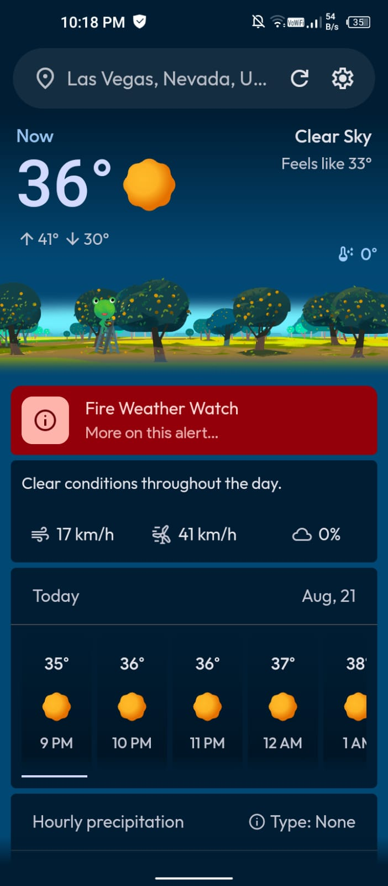
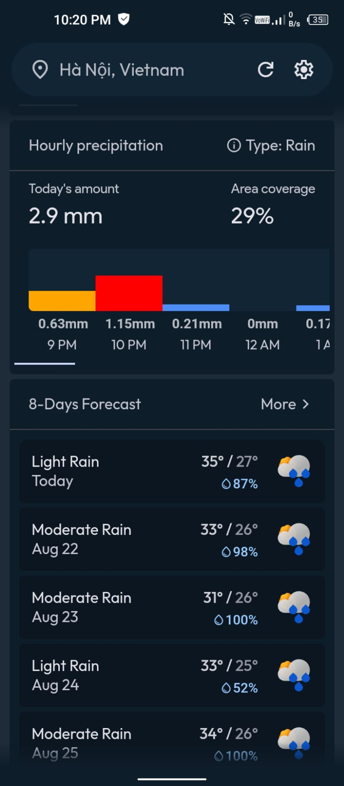
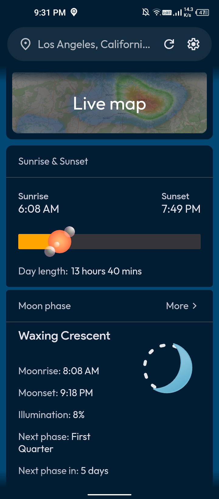
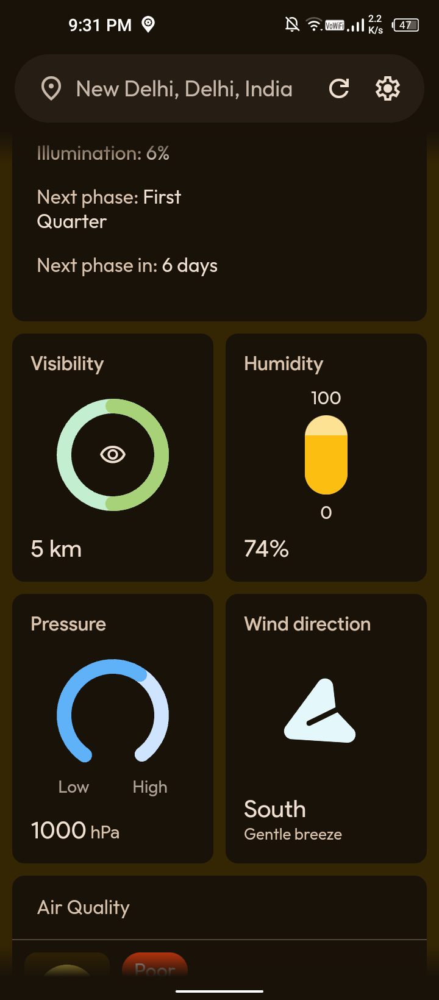
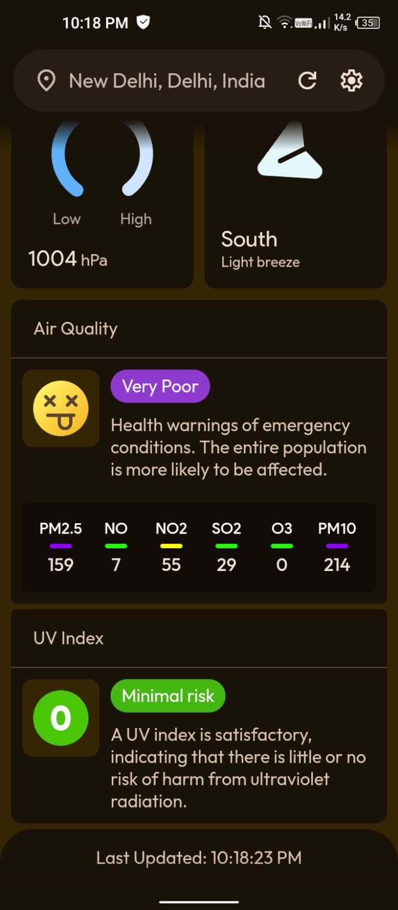
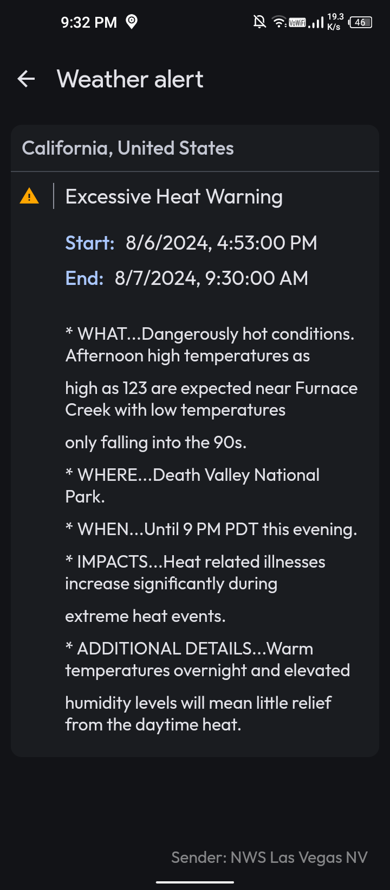
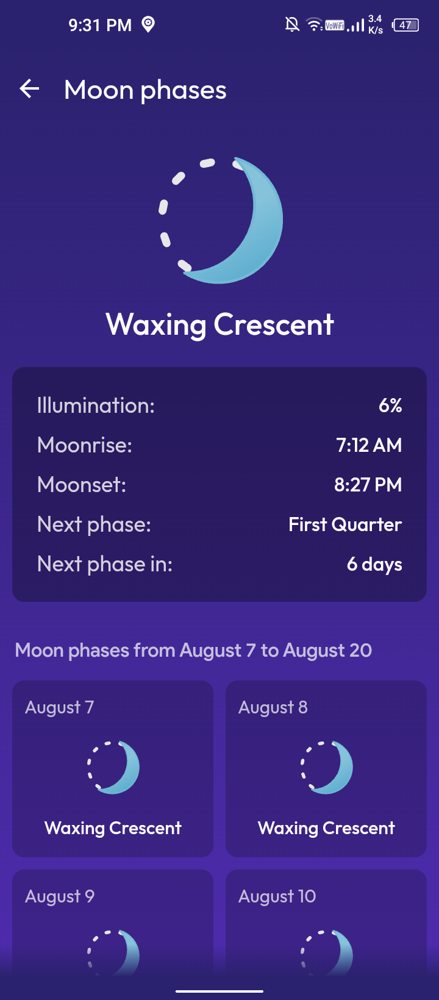
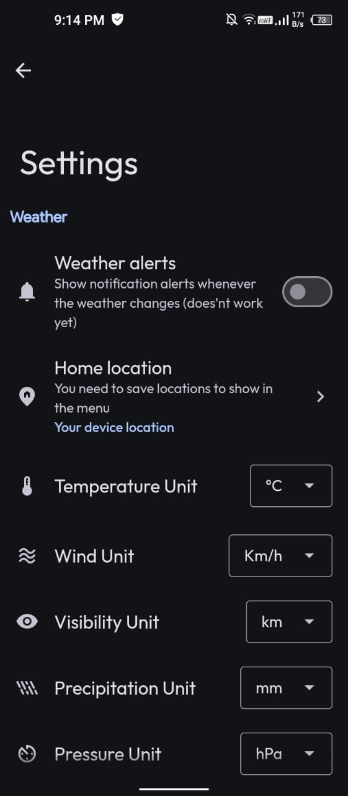

 # 🌦️ WeatherMaster 
 

WeatherMaster is developed with pure HTML, CSS, JavaScript, and Java. Designed to mimic the look and feel of a native Android app.

`(Last updated on 08-22-2024 at 9:49 AM UTC)`

# 👁️ Preview

> [!CAUTION]
> **Screenshots may differ from the current version.**

| Current & 48hrs |                                                                                                     Hourly prec & 8-days forecast|                                                                                           Radar & moon/sun|  Current Conditions| 
| :---: |                                                                                                    :---: |                                                                                                     :---: |             :---: | 
|  |   |    |    | 

| Air and UV index |                                                                                       Government alerts|                                                                                               Moon phases |   Settings| 
| :---: |                                                                                                    :---: |                                                                                                    :---: |          :---: | 
|  |   |  |   |

 

# 📲 Download

    

# ✨ Features:

- 🌤️ **Current Weather:** Get real-time updates on weather conditions in your area.
- 📢 **Government Weather Alerts:** Receive official alerts and warnings to stay safe.
- ⏳ **48-Hour Forecast:** Plan your short-term activities with accurate forecasts for the next two days.
- 📅 **8-Day Forecast:** View detailed weather predictions for the upcoming week.
- 🌙 **Moon Phases:** Track the phases of the moon and plan accordingly.
- 🌑 **Moonrise & Moonset:** Know the exact times for moonrise and moonset each day.
- 🌅 **Sunrise & Sunset:** Stay informed about sunrise and sunset times to optimize your day.
- 📏 **Day Length:** Check how long the daylight lasts each day.
- 📝 **Day Description:** Get a brief summary of the day’s weather conditions.
- 🌧️ **Rain Bar:** See a visual representation of expected rainfall.
- 👁️ **Visibility:** Monitor how far you can see clearly based on weather conditions.
- 💧 **Humidity:** Check the current humidity levels to stay comfortable.
- 🧭 **Pressure:** Track atmospheric pressure to understand weather changes.
- 🌬️ **Wind Direction & Speed:** Stay aware of wind patterns and strength.
- ❄️ **Snow Amount:** Know the expected snowfall for winter planning.
- ☁️ **Cloudiness:** See how much of the sky is covered by clouds.
- 🌡️ **Min-Max Temperature:** View the range of temperatures for the day.
- 🌬️ **Feels Like Temperature:** Understand how the temperature feels based on wind and humidity.
- 🌧️ **Precipitation Type & Area Coverage:** Get details on what kind of precipitation is expected and its coverage area.
- 🌞 **UV Index:** Stay protected from harmful UV rays with UV index updates.
- 🌿 **Air Quality:** Monitor air quality to stay informed about pollution levels.
- 🗺️ **Live Map:** Access a real-time map to track weather conditions in different areas.
- 📍 **Location Picker:** Easily select and view weather information for different locations.
- ⭐ **Save Favorite Locations:** Save your preferred locations for quick access to their weather updates.
- 👗 **Clothing Recommendations:** Get suggestions on what to wear based on the current weather conditions.

# ⚙️ Other:

 - 📱<strong>Native Android Experience: </stronge>Enjoy a user interface and interaction that closely resemble a native Android Weather app.
   
 - 🎨<strong>Material Design: </stronge>The app is built using Material Web Components, ensuring a clean, consistent, and visually appealing design.

 - ⚙️<strong>Customization Options: </stronge>Enjoy a ton of customization options. Adjust themes, Units.
   
 - 📐<strong>Responsive Design: </stronge>WeatherMaster is fully responsive for all mobile devices.
   
 - 🧩<strong>User-Friendly Interface: </stronge>The app's interface is designed to be straightforward and user-friendly.

# 🛠️ Built With:

 - <strong>HTML & CSS: </stronge> For the basic structure and styling of the app.
   
 - <strong>JavaScript: </stronge>To handle the app's logic and interactivity.

 - <strong>Weather data: </stronge> Using <a href="https://openweathermap.org/">OpenWeatherMap</a> to fetch weather, <a href="https://ipgeolocation.io/">ipgeolocation.io</a> for Moonset and Moonrise data, <a href="https://www.visualcrossing.com/">visualcrossing.com</a> for moon phases and <a href="https://opencagedata.com/api">api.opencagedata.com</a> for Geocoding 

 - <strong>Java: </stronge>Mainly used for JavaScript interface and permissions, allowing the app to run on Android devices.
   
 - <strong>Material Web Components: </stronge>Utilized to create a consistent and attractive Material Design look and feel.

 - <strong>Weather icons</strong>: <a href="https://gitlab.com/bignutty/google-weather-icons">Google weather icons

 # 📝 Todos:

 - **Translations**: Support for multiple languages will be added soon!
 - ⬛ Widgets 
 - ✅ Make it lightweight
 - ⬛ Notification alerts
 - ✅ Allows you to add multiple locations
 - ⬛ Customization (under construction)
 - ✅ More detailed weather 
 - ✅ Live weather map
 - ✅ Pick locations using map
 - ✅ Change app colors according to the weather
 -  Any user suggestions :)
 
 

> [!NOTE]
> The app is designed to run on Android devices and does not support web browsers. Attempting to open the app in a browser will not work.

 

# Contact
For any questions or feedback, feel free to open an issue on GitHub or contact pranshul.devmain@gmail.com

 

# License
This project is licensed under the MIT License. See the `LICENSE` file for details.

