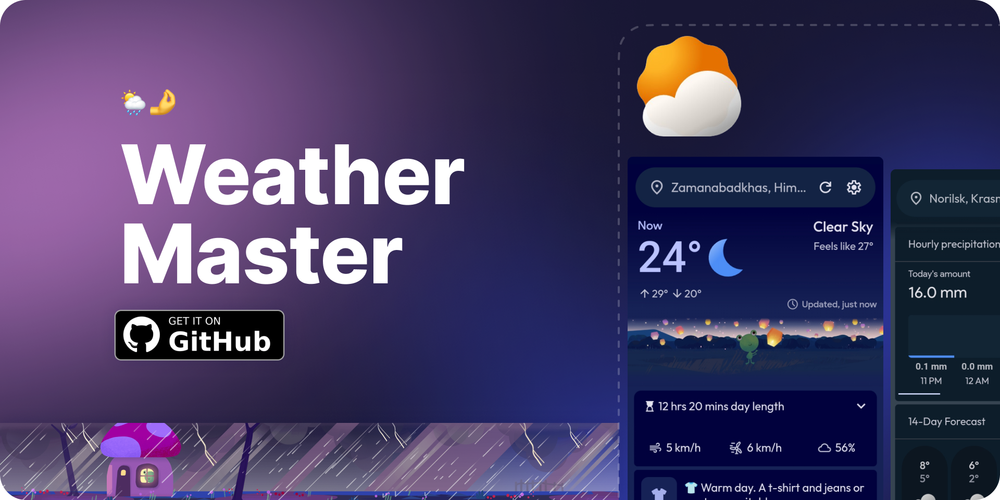
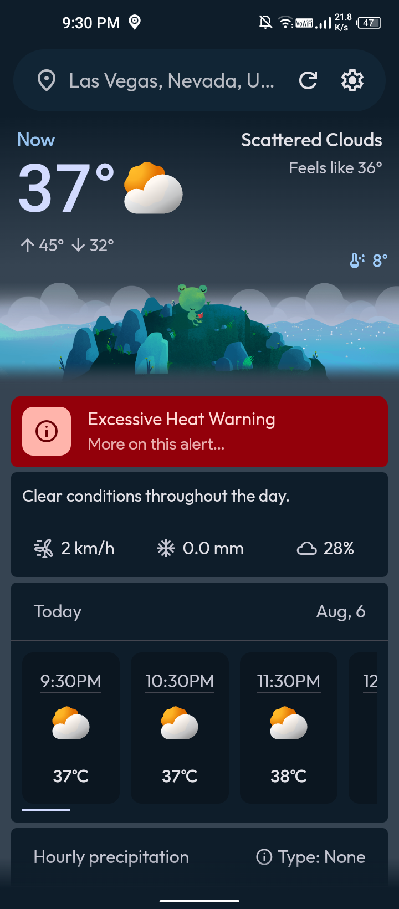
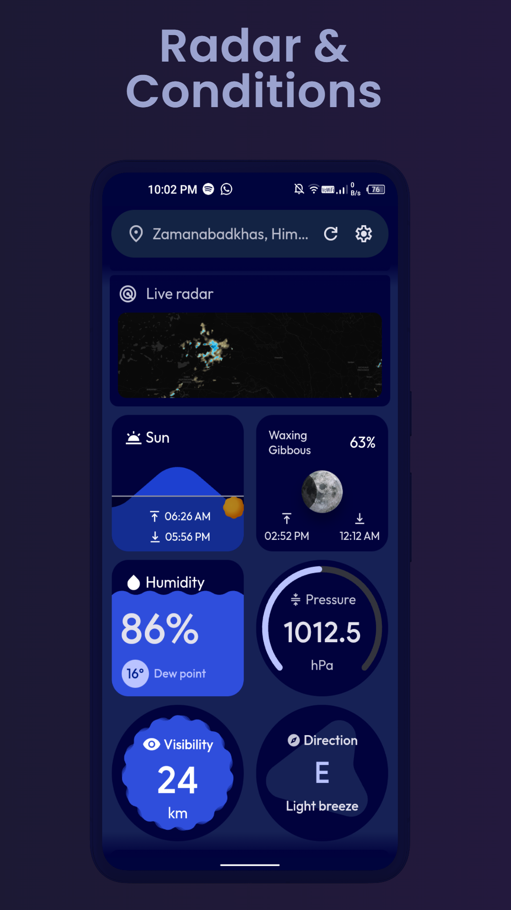
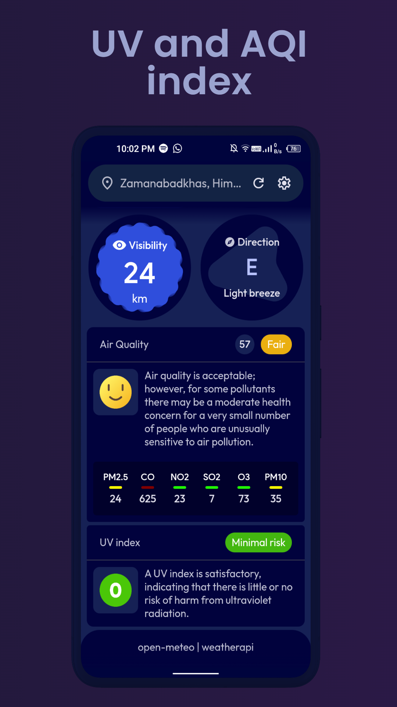
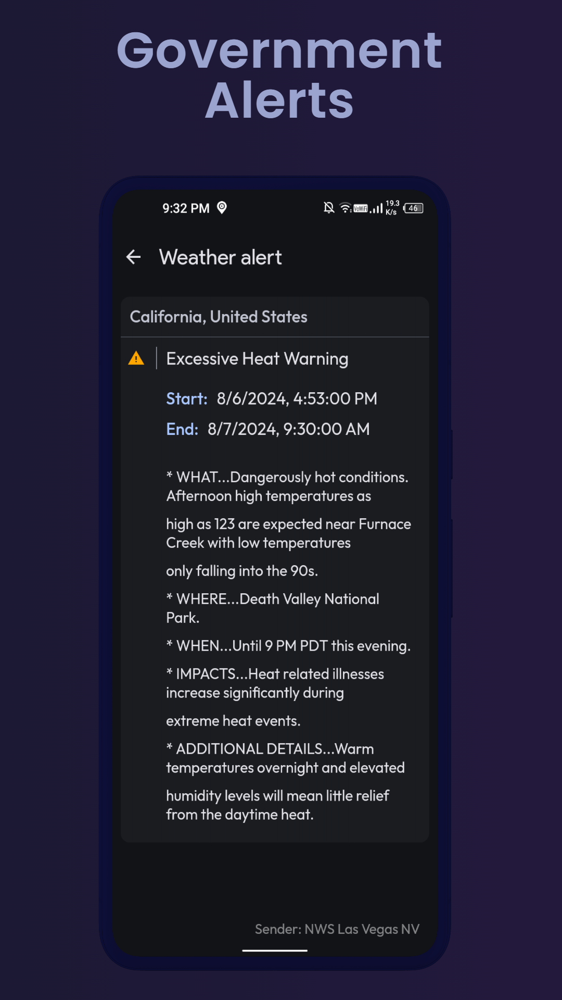
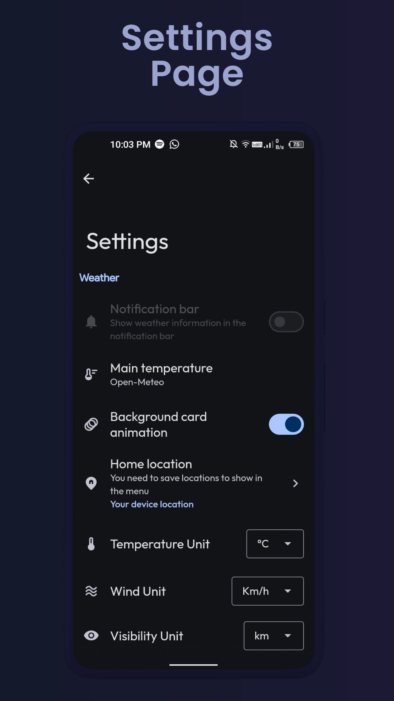
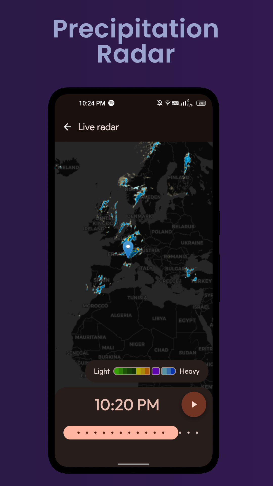
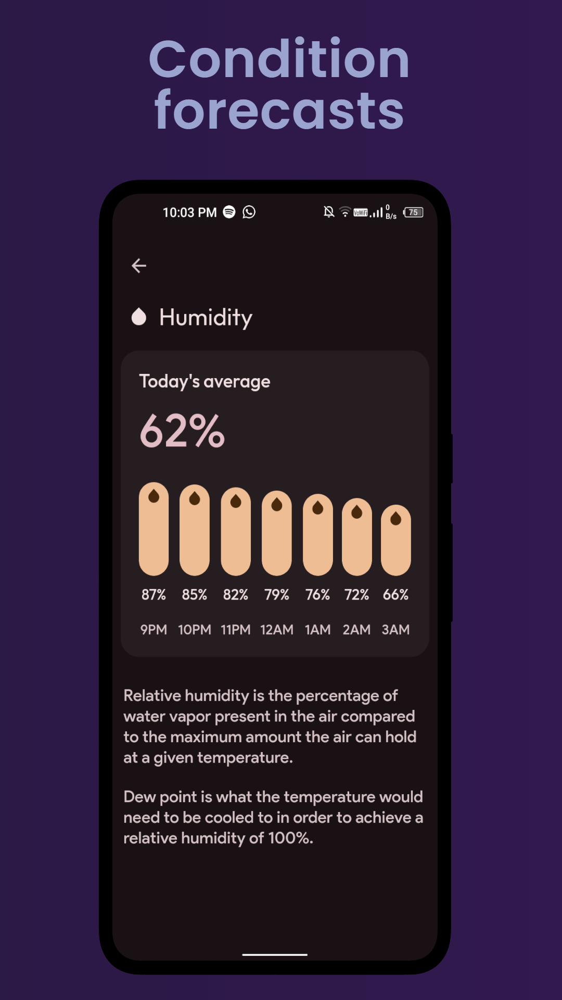

   

<h1 align="center">
 WeatherMaster
</h1>
   

      
      
      
       
      
      

   

   

   <h3>WeatherMaster: inspired by the Google Pixel weather app.</h3>
   

   

 
   

 

# 👁️ Screenshots

 

# ✨ Features:

- 🌍 **Offline Mode:** Access previously loaded weather data even without an internet connection.
- 🌤️ **Current Weather:** Get real-time updates on weather conditions in your area.
- 📢 **Government Weather Alerts:** Receive official alerts and warnings to stay safe.
- ⏳ **24-Hour Forecast:** Plan your short-term activities with accurate forecasts for the next two days.
- 📅 **14-Day Forecast:** View detailed weather predictions for the upcoming week.
- 🌙 **Moon Phases:** Track the phases of the moon and plan accordingly.
- 🌑 **Moonrise & Moonset:** Know the exact times for moonrise and moonset each day.
- 🌅 **Sunrise & Sunset:** Stay informed about sunrise and sunset times to optimize your day.
- 📏 **Day Length:** Check how long the daylight lasts each day.
- 📝 **Day Description:** Get a brief summary of the day’s weather conditions.
- 🌧️ **Rain Bar:** See a visual representation of expected rainfall.
- 👁️ **Visibility:** Monitor how far you can see clearly based on weather conditions.
- 💧 **Humidity:** Check the current humidity levels to stay comfortable.
- 🧭 **Pressure:** Track atmospheric pressure to understand weather changes.
- 🌬️ **Wind Direction & Speed:** Stay aware of wind patterns and strength.
- ❄️ **Snow Amount:** Know the expected snowfall for winter planning.
- ☁️ **Cloudiness:** See how much of the sky is covered by clouds.
- 🌡️ **Min-Max Temperature:** View the range of temperatures for the day.
- 🌬️ **Feels Like Temperature:** Understand how the temperature feels based on wind and humidity.
- 🌧️ **Precipitation Type & Area Coverage:** Get details on what kind of precipitation is expected and its coverage area.
- 🌞 **UV Index:** Stay protected from harmful UV rays with UV index updates.
- 🌿 **Air Quality:** Monitor air quality to stay informed about pollution levels.
- 🗺️ **Live Map:** Access a real-time map to track weather conditions in different areas.
- 📍 **Location Picker:** Easily select and view weather information for different locations.
- ⭐ **Save Favorite Locations:** Save your preferred locations for quick access to their weather updates.
- 👗 **Clothing Recommendations:** Get suggestions on what to wear based on the current weather conditions.
- 🌾 **Pollen Data (Europe Only):** View pollen levels for grass, trees, and weeds in your area.

# 🌞 Weather providers:
- [**open-meteo**](https://open-meteo.com)
- [**Met norway**](https://www.met.no/en)
- [**WeatherApi**](https://www.weatherapi.com/)
- [**OpenWeatherMap**](https://openweathermap.org/api)
- [**accuweather**](https://www.accuweather.com/)

# ⚙️ Other:

- 📱<strong>Native Android Experience: </stronge>Enjoy a user interface and interaction that closely resemble a native Android Weather app.

- 🎨<strong>Material Design: </stronge>The app is built using Material Web Components, ensuring a clean, consistent, and visually appealing design.

- ⚙️<strong>Customization Options: </stronge>Enjoy a ton of customization options. Adjust themes, Units.

- 📐<strong>Responsive Design: </stronge>WeatherMaster is fully responsive for all mobile devices.

- 🧩<strong>User-Friendly Interface: </stronge>The app's interface is designed to be straightforward and user-friendly.

# 🛠️ Built With:

- <strong>HTML & CSS: </stronge> For the basic structure and styling of the app.

- <strong>JavaScript: </stronge>To handle the app's logic and interactivity.

- <strong>Java: </stronge>Mainly used for JavaScript interface and permissions, allowing the app to run on Android devices.

- <strong>Material Web Components: </stronge>Utilized to create a consistent and attractive Material Design look and feel.

- <strong>Weather icons</strong>: <a href="https://gitlab.com/bignutty/google-weather-icons">Google weather icons

# 📝 Todos:

- ✅ Adding cache to reduce api requests
- ✅ Translations
- ⬛ Widgets / Notifications (under construction)
- ✅ Make it lightweight
- ✅ Allows you to add multiple locations
- ✅ Customization
- ✅ More detailed weather
- ✅ Live weather map
- ✅ Pick locations using map
- ✅ Change app colors according to the weather
-  Any user suggestions :)
    
    

> [!NOTE]
> The app is designed to run on Android devices and does not support web browsers. Attempting to open the app in a browser will not work.
 

# Contact
For any questions or feedback, feel free to open an issue on GitHub or contact pranshul.devmain@gmail.com

 

# License
This project is licensed under the GPL-3.0 license. See the `LICENSE` file for details.

