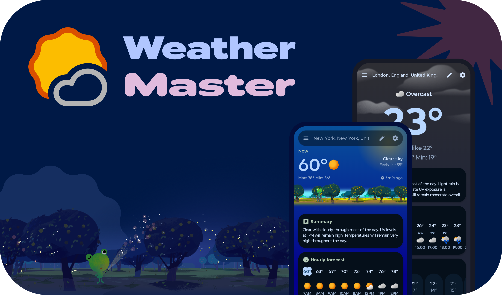
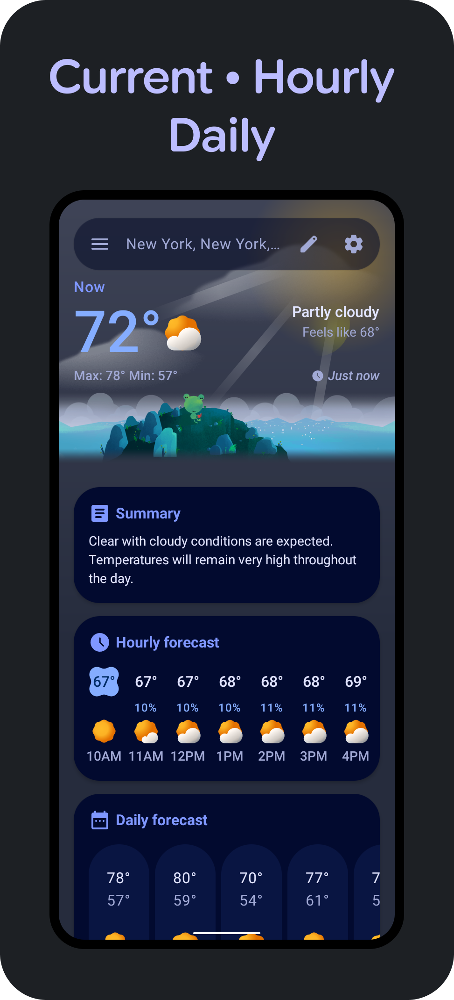
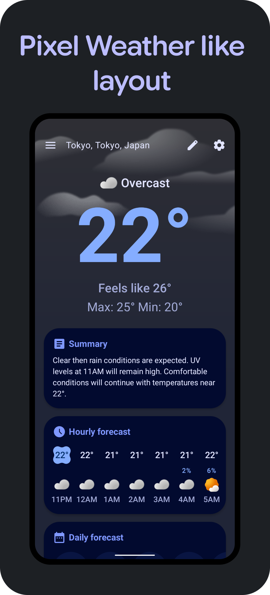
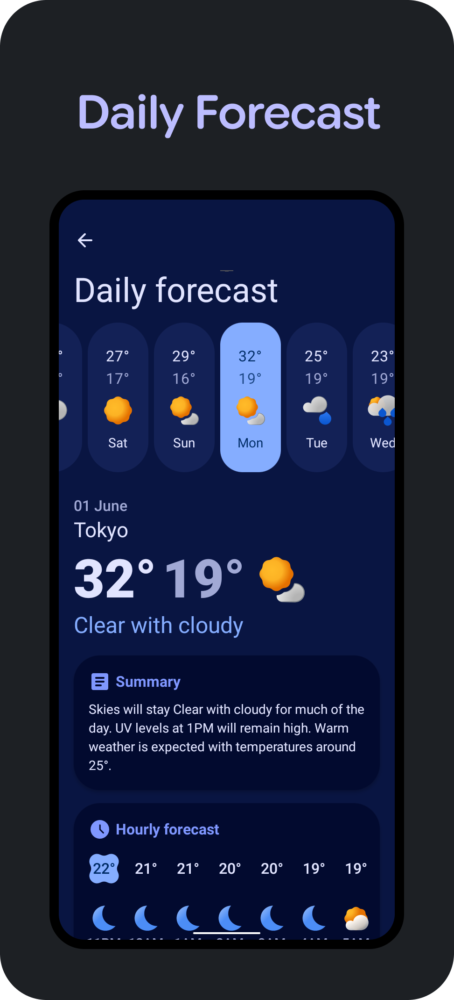
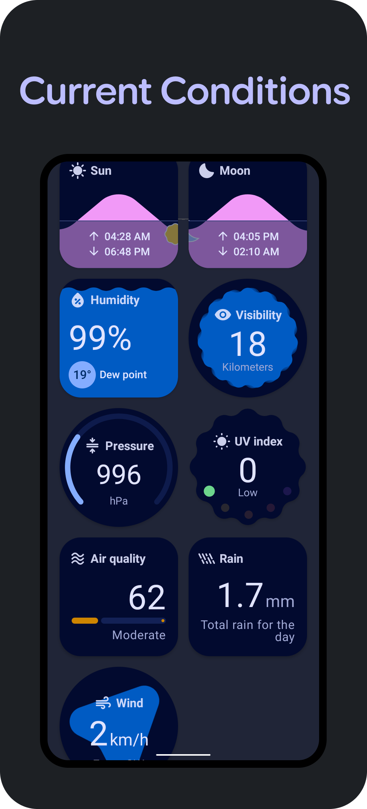
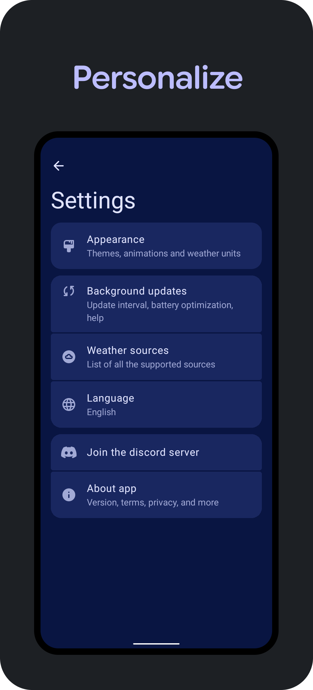

   

 
<h1 align="center">
 WeatherMaster
</h1>
   

      
      
      
       
      
      
      

   

   

   

   

   <h3>WeatherMaster: inspired by the Google Pixel weather app.</h3>

   

 

[Features](https://github.com/PranshulGG/WeatherMaster?tab=readme-ov-file#-features) • [Contact](https://github.com/PranshulGG/WeatherMaster?tab=readme-ov-file#%EF%B8%8F-contact) • [License](https://github.com/PranshulGG/WeatherMaster?tab=readme-ov-file#%EF%B8%8F-license) • [Translate](https://github.com/PranshulGG/WeatherMaster?tab=readme-ov-file#-translate-the-app-on-crowdin)
 

 
   

 

# 👁️ Screenshots

 

# 🌐 Translate the app on [Crowdin](https://crowdin.com/project/weathermaster)

- **Feel free to open an issue if you want to request a language**

# 🌦️ Supported weather sources

- **Open Meteo**
- **Met Norway**
- **NWS**
- **SMHI**
- **DWD**
- **Meteo-France**
- **FMI**
- **ECCC**
- _**And more to be added**_

# ✉️ Contact

For any questions or feedback, feel free to open an issue on GitHub or contact
pranshul.devmain@gmail.com

# ©️ License

This project is licensed under the GPL-3.0 license. See the `LICENSE` file for details.
